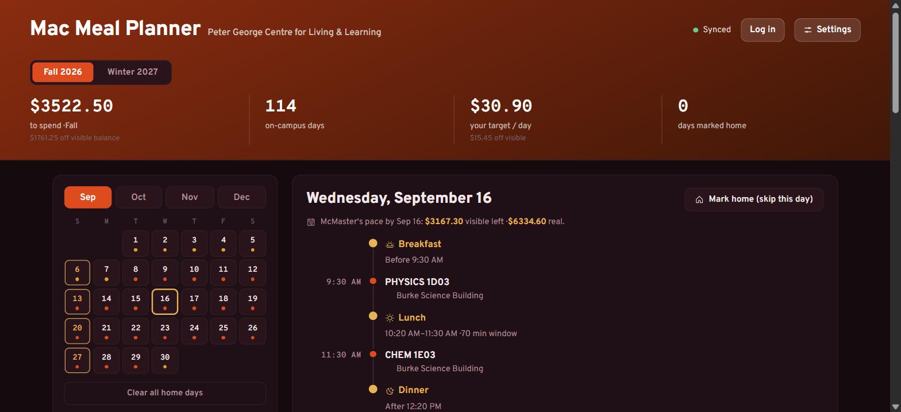
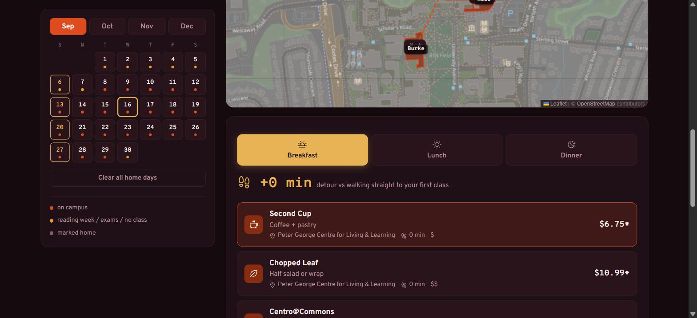

# Mac Meal Planner

A meal-budgeting planner for McMaster University students. Enter your class
schedule and meal plan, and it maps every on-campus day to real dining options
near your classes, tracks your spending pace against McMaster's own budget
guide, and tells you how much time you actually have to eat between lectures.

**Live:** https://mcmaster-meal-plan.pages.dev

> Unofficial. Not affiliated with, endorsed by, or connected to McMaster
> University or McMaster Hospitality Services. Budget figures are derived from
> McMaster's published 2026–2027 Budget Planner; always check your real balance
> in MacExpress.





## What it does

- **Schedule import** — paste your timetable text (most reliable) or upload the
  McMaster PDF; a heuristic parser turns either into an editable class table.
  Handles both of McMaster's export formats and both semesters.
- **Real campus geography** — building footprints and coordinates pulled from
  OpenStreetMap. Walking times are straight-line distance at ~75 m/min. For the
  one meal genuinely sandwiched between two classes, it computes minutes left at
  the table after walking there and back.
- **Computed dining options** — every meal slot ranks non-hidden venues by walk
  time from that meal's anchor building, filtered by your dietary preferences,
  with real posted prices where McMaster publishes them (chain estimates
  otherwise, marked `*`).
- **The meal-plan budget model** — see below.
- **Per-day and per-semester targets** — your projected spend from your actual
  picks, versus McMaster's recommended weekly pace, with checkpoint markers on
  the calendar.
- **Fall / Winter** — a separate timetable per term; the calendar, schedule, and
  budget all follow the term you're viewing.
- **Optional accounts** — by default your setup lives under a private `?u=` link.
  Making an account locks that planner to your login.

## How the budget model works

A McMaster meal plan is one declining balance for the whole academic year
(late August to mid-April), not a per-term allotment. The plan price (~$7,000
for the cheapest traditional plan) is split 50/50:

- a **visible balance** — the number that goes down in MacExpress
  ($3,522.50 for Traditional A), and
- an equal **overhead match** you never see directly.

Every purchase draws half from each bucket, so $100 of food costs $50 of visible
balance. Real spending power is double the visible number. The app shows both,
per semester: Traditional A works out to about **$1,761 visible / $3,522 real
per term**, or roughly **$15/day off your visible balance, $30/day of real
spending**.

The "recommended pace" line and the gold calendar checkpoints come straight from
McMaster's official Budget Planner (interpolated between its 34 week-ending
balances). Your own projection is separate — it's built from the meals you pick
and the days you mark as home.

## Tech

- **Cloudflare Pages** for the static frontend, **Pages Functions** for the API
- **D1** (SQLite) for planner state and accounts, **KV** for legacy migration
- Vanilla JS, no framework or build step — `public/app.js` is the whole app
- **Leaflet** + OpenStreetMap tiles for the map, **pdf.js** for PDF parsing
  (both vendored into `public/vendor/`, no CDN)
- PBKDF2-SHA256 password hashing and HMAC-signed stateless session cookies via
  the Web Crypto API
- Strict CSP, security headers, and `noindex` set in `public/_headers`

### Structure

```
public/          served as-is (index.html, app.js, privacy.html, vendor/, _headers)
functions/api/   Pages Functions — /api/state and /api/auth/*
migrations/      D1 schema migrations
```

### Local development

```bash
npm install
npm run db:migrate:local            # apply migrations to the local D1
echo "SESSION_SECRET=$(openssl rand -hex 32)" > .dev.vars
npm run dev                          # wrangler pages dev
```

`npm run stats` prints live usage counts (needs `wrangler login`).

## License

No license — all rights reserved. You're welcome to read it.
